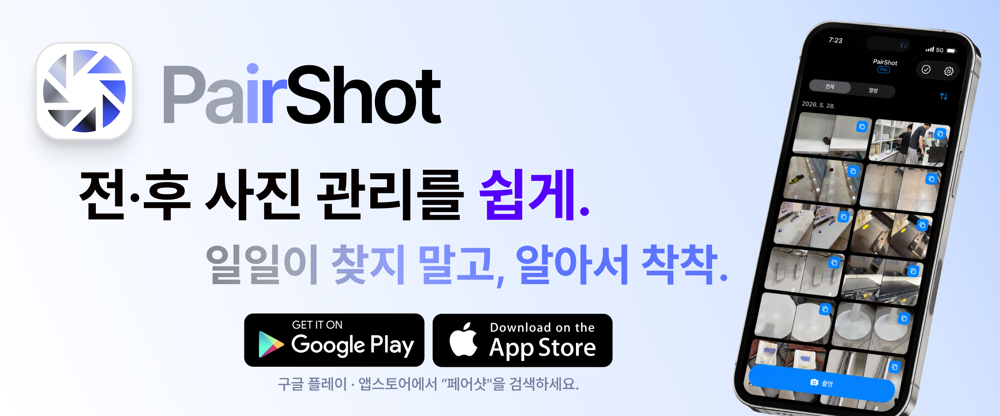

<h1>PairShot</h1>
<h3>Before·After 촬영 및 관리 애플리케이션</h3>

**[🌐 웹사이트 바로가기](https://pairshot.nomadlabs.kr)** &nbsp;·&nbsp; **[ 다운로드](https://play.google.com/store/apps/details?id=com.pairshot&pcampaignid=web_share)**

비포·애프터 촬영 및 관리 전용 카메라 애플리케이션. 
비포·애프터 촬영 및 관리 보조, 일괄 합성 등 현장 작업자의 번거로운 워크플로우를 개선합니다.

 

## 기술 스택

**`Core`**

**`Camera & Image`**

**`Data & DI`**

**`Navigation & Serialization`**

**`Build & Quality`**

 

## 주요 기능

### 촬영

<table>
<tr>
<td width="50%" valign="top">

#### BEFORE 오버레이 가이드
BEFORE 사진을 카메라 프리뷰에 오버레이 형식으로 표시하여 촬영 구도를 쉽게 맞출 수 있도록 보조합니다.
투명도 옵션 토글 및 조절 방식으로 사용자 별 커스텀이 가능합니다.

</td>
<td width="50%" valign="top">

#### 스트립 캐러셀
AFTER 촬영 중 매번 각 BEFORE 사진을 기기앨범 또는 홈화면에서 조회할 필요없도록, AFTER 촬영 페어가 없는 BEFORE 사진 리스트를 표시합니다. 
촬영 화면에서 잔여 BEFORE 사진을 슬라이드 제스처로 조회 및 선택할 수 있으며, 각 카드 별 롱프레스 제스처로 미리보기 확대 기능을 제공합니다.

</td>
</tr>
<tr>
<td width="50%" valign="top">

#### 회전 가이드
각 BEFORE 사진이 촬영 당시 기기를 가로 또는 세로 중 어느 방향으로 촬영한 사진인지 안내합니다.  
BEFORE 스트립의 카드 별 고정 아이콘으로 표시하며, 카메라 프리뷰에서는 현재 기기 센서 값에 따라 동적으로 기기 회전 방향을 안내합니다.

</td>
<td width="50%" valign="top">

#### 카메라 옵션
1:1 · 4:3 · 16:9 촬영 비율 설정 옵션 및 격자 그리드, 수평계, 오버레이 토글, 야간모드, 조도 조절 옵션을 제공합니다.

</td>
</tr>

</table>

### 전·후 사진 관리

<table>
<tr>
<td width="50%" valign="top">

#### 페어 카드
전·후 사진을 개별 사진이 아닌 한 쌍의 페어 카드 UI/UX 형식으로 관리할 수 있습니다.  
각 카드 별 삭제 · AFTER만 삭제 · 합성 결과 미리보기 모달 · 기기저장 · Sharesheet 공유 기능을 제공합니다.

</td>
<td width="50%" valign="top">

#### 전·후 합성
페어 카드 전·후 사진의 원본 비트맵을 합성하여 단일 합성 이미지를 생성할 수 있습니다.  
테두리 · 레이블 설정 기능을 제공하며, 각각 색상 · 사이즈 · 두께 · 레이블 위치 등 세부 커스텀 가능한 옵션 설정 기능을 제공합니다.

</td>
</tr>
<tr>
<td valign="top">

#### 워터마크 설정
텍스트 반복 워터마크 · 로고 이미지 워터마크 자동 삽입이 가능합니다.  
텍스트 및 이미지의 사이즈, 투명도 등 세부 커스텀 옵션 설정 기능을 제공합니다.

</td>
<td valign="top">

#### 내보내기 및 공유
선택된 페어 카드 이미지를 내 기기에 저장 또는 Sharesheet를 통한 전송이 가능합니다.  
설정된 옵션 (내보낼 사진 종류, 파일 형식, 워터마크 삽입 여부, 합성 적용 여부)을 선택한 페어 카드에 일괄 적용하여 내보내기 또는 공유가 가능합니다.

</td>
</tr>
</table>

 

---

## 릴리즈 노트

| 버전 | 날짜 | 주요 내용                                                                                                                           |
|------|------|---------------------------------------------------------------------------------------------------------------------------------|
| [v1.5.1](./docs/releases/v1.5.1.md) | 2026-06-29 | 전후 사진 합성 종횡비 1:1 통일 · AFTER 스트립 촬영 방향 표시 아이콘 추가                                                               |
| [v1.5.0](./docs/releases/v1.5.0.md) | 2026-06-17 | 최초 설치 페이월 닫기 버튼 추가 · 광고 제거 전용 프로모션 폐기 및 프로모션 혜택 Pro로 통일                                                                         |
| [v1.4.1](./docs/releases/v1.4.1.md) | 2026-06-08 | 약관·개인정보·홈페이지 외부 링크 도메인을 `pairshot.nomadlabs.kr` 로 전환 · 프로모션 등록 다이얼로그에서 안드로이드 비사용 외부 안내 라벨 제거                                    |
| [v1.4.0](./docs/releases/v1.4.0.md) | 2026-05-30 | 내보내기 프리셋 시스템 도입 (무료 2 · Pro 4 슬롯) · 홈/앨범 상세/페어 추가가 같은 페어 카드 그리드와 정렬 토글 공유 · 삭제 모달 6종을 같은 하단 시트 UX로 통일                           |
| [v1.3.2](./docs/releases/v1.3.2.md) | 2026-05-24 | 결제 화면 구독 카드 정리 — 연간 할인율 가격 기반 자동 계산 · 카드 정보 영역을 카드별 고유 항목만 남기는 방향으로 단순화 · 하단 보조 링크 순서 교체                                        |
| [v1.3.1](./docs/releases/v1.3.1.md) | 2026-05-24 | 설정에 **텍스트 크기** 항목 신설 + 기기 글꼴/디스플레이 크기 슬라이더 영향 차단 · 큰 글꼴에서 튜토리얼 풍선이 셔터·스트립 가리던 회귀 차단 · BEFORE 크게보기 닫기 안내 단계 추가                   |
| [v1.3.0](./docs/releases/v1.3.0.md) | 2026-05-23 | 합성 레이블 "테두리 내부" 모드 신설 — 이미지 가리지 않고 BEFORE/AFTER 각각 6 칸 자유 배치 · AFTER 촬영 중 BEFORE 길게 누르기 미리보기 · PRO 구독 옵션 진입점 + paywall 자동 닫힘 방지 |
| [v1.2.2](./docs/releases/v1.2.2.md) | 2026-05-17 | 튜토리얼 UX 다듬기 — 프리뷰 가시성 · 흰색 spotlight 테두리 · AFTER 스트립 안내 · 내보내기 재진입 아이콘 · 마지막 모달 중앙 배치 · 문구 일관화                                  |
| [v1.2.1](./docs/releases/v1.2.1.md) | 2026-05-17 | v1.2.0 과 코드 동일 · Play Console 재업로드용 versionCode bump                                                                            |
| [v1.2.0](./docs/releases/v1.2.0.md) | 2026-05-17 | 인터랙티브 튜토리얼 + Google Play 구독·프로모션 통합 + 카메라 비율·내보내기 파이프라인 보강                                                                      |
| [v1.1.6](./docs/releases/v1.1.6.md) | 2026-04-29 | v1.1.5 업데이트 크래시 핫픽스 + 마이그레이션 회귀 자동 차단                                                                                           |
| [v1.1.3](./docs/releases/v1.1.3.md) | 2026-04-25 | AdMob App Open·Native·Rewarded 프로덕션 ID 교체                                                                                       |
| [v1.1.2](./docs/releases/v1.1.2.md) | 2026-04-25 | 쿠폰 사용자 리워드 다이얼로그 노출 제거                                                                                                         |
| [v1.1.1](./docs/releases/v1.1.1.md) | 2026-04-25 | QR 스캔 R8 minify 크래시 핫픽스                                                                                                         |
| [v1.1.0](./docs/releases/v1.1.0.md) | 2026-04-24 | 쿠폰 시스템 · 광고 통합·배치 · 카메라 회전 가이드 내부 릴리즈                                                                                         |
| [v1.0.0](./docs/releases/v1.0.0.md) | 2026-04-24 | PairShot Android 버전 구글 플레이 스토어 최초 출시                                                                                                                           |

 

---

© 2026 NomadLabs. All rights reserved.

